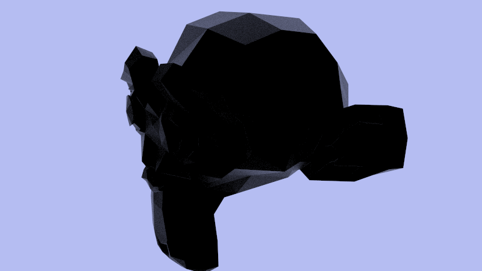
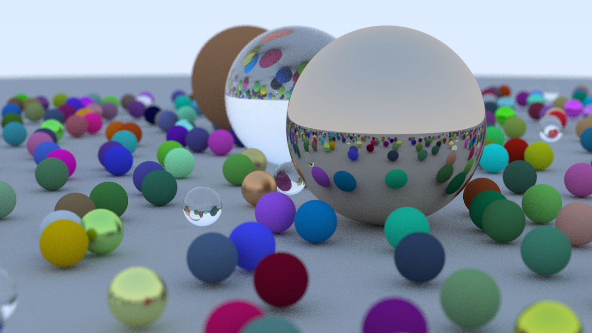

# Raytracer
Somewhat simple ray tracer, or more specifically, path tracer. This tracer was built following the 
[ray tracer in one weekend book](https://raytracing.github.io/). It is not a word for word copy since
I diverted from the book and just used it for reference.

This is just a hobby project I wrote for fun but some of the code has come in handy for other projects
too (for example the BMP write code). So anyone that wants to use code from this project is welcome to
do so.

## Current state of things

## Performance evaluation side of things
### Comparable ray tracers
- https://github.com/wjakob/nori
- https://github.com/JiayinCao/SORT
- https://github.com/Twinklebear/tray_rust
- https://github.com/vkoskiv/c-ray
- 

## plan
Since there really arent any "standarized" tests for 3d renderers,
I'm going to be creating my own, and this means i have free reign
in terms of shadering techniques.

Im going to implement blin phong model because OBJs use that model
and then 

actually, scrap that, it might be easier to support GLTF files and 
support their metallic-roughness PBR model (since I probably already 
have the code).

Once I have that it will be easy to support scene creation etc to
profile the performance of my code.

It still might be a good idea to create my own shader system or
adopt an existing one so that I can generate code that runs on the
GPU / translate code into machine instructions for the CPU to speed
it up